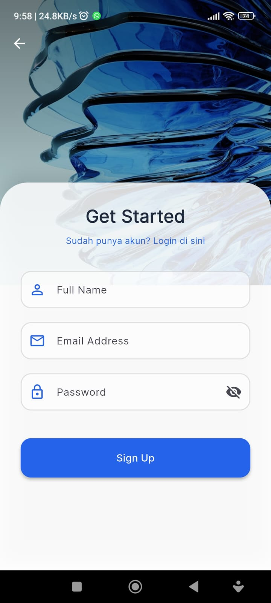
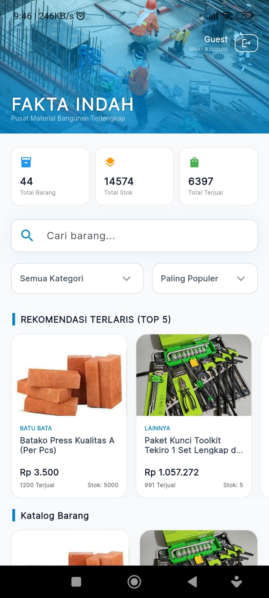
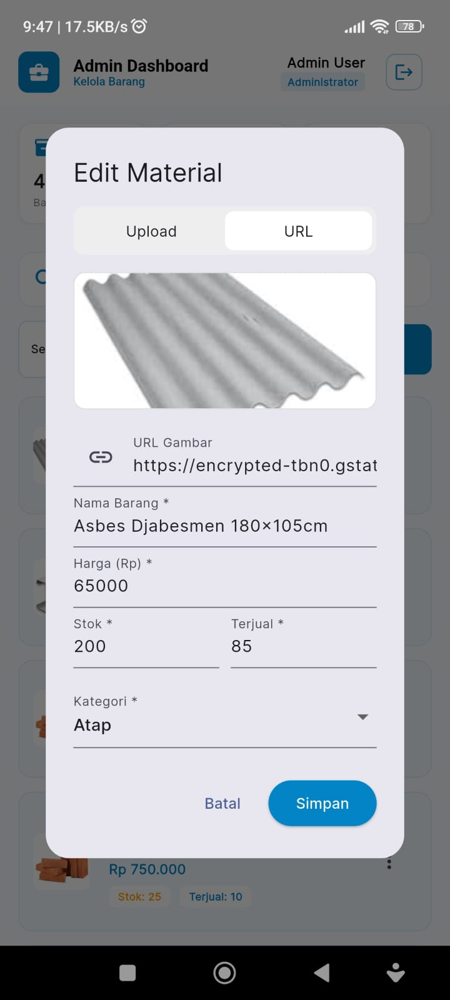
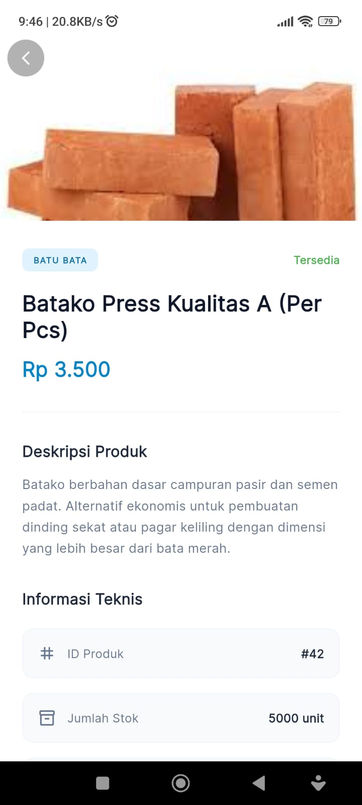
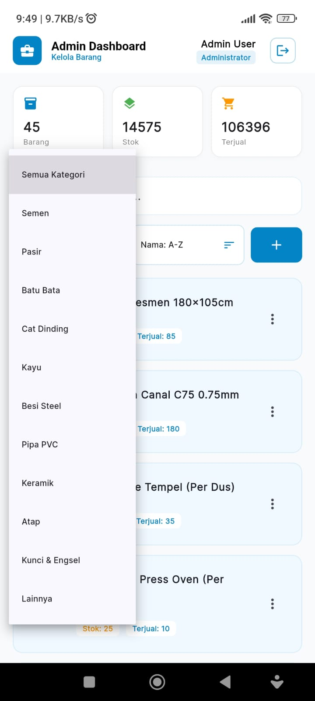

# AL-Tex Engineer: Professional Mobile Solution
## Enterprise-Grade Technical Engineering Management System


[](https://flutter.dev)
[](https://dart.dev)
[](https://pub.dev)
[](https://github.com/JM-glich)
[]()

---

## Daftar Isi
1. [Visi & Deskripsi Proyek](#-visi--deskripsi-proyek)
2. [Pratinjau Antarmuka (Screenshots)](#-pratinjau-antarmuka-screenshots)
3. [Fitur Utama & Modul](#-fitur-utama--modul)
4. [Arsitektur Perangkat Lunak](#-arsitektur-perangkat-lunak)
5. [Spesifikasi Teknis](#-spesifikasi-teknis)
6. [Struktur Proyek (Deep Dive)](#-struktur-proyek-deep-dive)
7. [Panduan Instalasi & Konfigurasi](#-panduan-instalasi--konfigurasi)
8. [Manajemen State & Aliran Data](#-manajemen-state--aliran-data)
9. [Integrasi Backend & Database](#-integrasi-backend--database)
10. [Standar Penulisan Kode (Linting)](#-standar-penulisan-kode-linting)
11. [Pengujian (Testing)](#-pengujian-testing)
12. [Panduan Deployment](#-panduan-deployment)
13. [Kontributor & Tim](#-kontributor--tim)

---

## Visi & Deskripsi Proyek

**AL-Tex Engineer** bukan sekadar aplikasi mobile biasa. Proyek ini dirancang sebagai solusi komprehensif bagi para engineer dan teknisi di lapangan untuk mengelola alur kerja teknis secara presisi. Dibangun di atas ekosistem **Flutter**, aplikasi ini mengutamakan performa tinggi, sinkronisasi data real-time, dan UI yang intuitif untuk kebutuhan profesional.

Proyek ini merupakan implementasi dari mata kuliah **Pemrograman Aplikasi Bergerak (PAB)**, yang menggabungkan prinsip-prinsip rekayasa perangkat lunak modern, termasuk pemisahan perhatian (*separation of concerns*), skalabilitas, dan kemudahan pemeliharaan (*maintainability*).

---

## Pratinjau Antarmuka (Screenshots)

Aplikasi ini menggunakan filosofi **Material 3 Design** dengan optimasi pada aspek keterbacaan data teknis.

| Authentication | Dashboard Utama | Data Engineering |
| :---: | :---: | :---: |
|  |  |  |

| Product Detail | Monitoring Real-time |
| :---: | :---: |
|  |  |

> **Catatan:** Semua aset gambar di atas dapat ditemukan pada direktori `assets/images/`. Pastikan untuk melakukan kompresi gambar sebelum deployment untuk menjaga ukuran APK tetap ringan.

---

## Fitur Utama & Modul

### 1. Modul Manajemen Proyek
* **Dynamic Task Allocation:** Penugasan engineer berdasarkan spesialisasi secara otomatis.
* **Progress Tracking:** Visualisasi progres proyek menggunakan progress bar kustom.
* **Priority System:** Labeling tingkat urgensi pada setiap tiket pekerjaan.

### 2. Modul Autentikasi & Keamanan
* **Secure Auth:** Integrasi JWT/Supabase Auth dengan proteksi session.
* **Role-Based Access Control (RBAC):** Perbedaan hak akses antara Admin, Lead Engineer, dan Field Technician.
* **Biometric Ready:** Struktur kode yang disiapkan untuk integrasi FaceID/Fingerprint.

### 3. Modul Sinkronisasi Data
* **Offline First:** Kemampuan input data saat tidak ada sinyal, dengan sinkronisasi otomatis saat online.
* **Cloud Integration:** Terhubung langsung dengan database cloud (Supabase/Firebase) untuk integritas data.

---

## Arsitektur Perangkat Lunak

Kami mengadopsi **Clean Architecture** yang dikombinasikan dengan pola **MVVM (Model-View-ViewModel)**. Hal ini memastikan logika bisnis tidak tercampur dengan kode UI.

### Layer-layer Arsitektur:
1.  **Core Layer:** Berisi konstanta global, tema aplikasi, dan helper fungsi utilitas.
2.  **Data Layer:** Bertanggung jawab atas pengambilan data (Remote Data Source & Local Data Source) serta implementasi Repositori.
3.  **Domain Layer:** Jantung dari aplikasi. Berisi *Entities* dan *Use Cases* yang murni menggunakan Dart tanpa ketergantungan pada Flutter.
4.  **Presentation Layer:** Berisi UI (Widgets/Screens) dan *State Management* (Controller/ViewModel).

---

## Spesifikasi Teknis

* **SDK:** Flutter >= 3.10.0 | Dart >= 3.0.0
* **State Management:** [Provider / GetX / BLoC] - *Pilih salah satu sesuai kodinganmu*
* **Local Database:** Hive / SQLite (untuk caching)
* **Remote Service:** Supabase / REST API
* **Networking:** Dio / Http dengan Interceptor
* **Logging:** Logger / Alice for Network Inspection

---

## Struktur Proyek (Deep Dive)

Struktur folder diatur secara modular agar memudahkan kolaborasi tim besar:

```text
.
├── android/                # Konfigurasi spesifik Android (Gradle, Manifest)
├── assets/                 # Aset statis aplikasi
│   ├── fonts/              # Font kustom (e.g., Google Sans, Poppins)
│   ├── images/             # Icon, Logo, dan Screenshots
│   └── json/               # Mock data atau Lottie animations
├── ios/                    # Konfigurasi spesifik iOS (Runner, Info.plist)
├── lib/                    # Direktori utama kode Dart
│   ├── core/               # Konfigurasi global & tema
│   │   ├── constants/      # App constants, API endpoints
│   │   ├── services/       # Global services (Auth, Storage)
│   │   └── theme/          # Color scheme & Typography
│   ├── data/               # Layer Data
│   │   ├── models/         # DTO (Data Transfer Objects)
│   │   ├── repositories/   # Implementasi Repositori
│   │   └── sources/        # Remote & Local data sources
│   ├── domain/             # Layer Domain (Business Logic)
│   │   ├── entities/       # Objek bisnis murni
│   │   └── usecases/       # Aksi spesifik pengguna
│   ├── presentation/       # Layer UI
│   │   ├── controllers/    # Logic penghubung UI & Data
│   │   ├── pages/          # Layar utama (Screens)
│   │   └── widgets/        # Komponen UI kecil & reusable
│   └── main.dart           # File utama untuk running aplikasi
├── test/                   # Unit, Widget, dan Integration Testing
└── pubspec.yaml            # Manajemen dependensi dan aset
````

-----

## Panduan Instalasi & Konfigurasi

### Langkah 1: Kloning Repositori

```bash
git clone [https://github.com/JM-glich/AL-Tex-Engineer_PAB.git](https://github.com/JM-glich/AL-Tex-Engineer_PAB.git)
cd AL-Tex-Engineer_PAB
```

### Langkah 2: Konfigurasi Environment

Buat file `.env` di root folder dan masukkan kredensial API Anda (Jika menggunakan paket `flutter_dotenv`):

```env
BASE_URL=[https://api.yourdomain.com](https://api.yourdomain.com)
API_KEY=your_secret_api_key
SUPABASE_URL=your_supabase_url
SUPABASE_ANON_KEY=your_anon_key
```

### Langkah 3: Setup Dependencies

Bersihkan cache dan ambil library terbaru:

```bash
flutter clean
flutter pub get
```

### Langkah 4: Menjalankan Aplikasi

Pilih device (Emulator atau Real Device) dan eksekusi:

```bash
flutter run
```

Untuk mode Release (Optimasi performa):

```bash
flutter run --release
```

-----

## Manajemen State & Aliran Data

Kami memastikan data mengalir secara satu arah (*Unidirectional Data Flow*):

1.  **View** memicu sebuah aksi di **Controller**.
2.  **Controller** memanggil **Use Case** di layer Domain.
3.  **Use Case** meminta data dari **Repository**.
4.  **Repository** mengambil data dari **API** atau **Local DB**.
5.  Data dikembalikan ke **Controller**, dan UI diperbarui secara reaktif.

-----

## Standar Penulisan Kode (Linting)

Proyek ini mengikuti standar `flutter_lints`. Pastikan tidak ada *warning* sebelum melakukan *commit*:

  * Gunakan `camelCase` untuk variabel dan fungsi.
  * Gunakan `PascalCase` untuk nama class.
  * Wajib menggunakan `const` constructor jika memungkinkan untuk optimasi memori.
  * Hindari `print()` pada mode produksi, gunakan `log()` atau `debugPrint()`.

-----

## Pengujian (Testing)

Kualitas kode adalah prioritas utama. Kami menerapkan:

1.  **Unit Testing:** Menguji logika bisnis di layer domain.
2.  **Widget Testing:** Memastikan komponen UI merender data dengan benar.
3.  **Integration Testing:** Menguji alur aplikasi dari login hingga dashboard secara otomatis.

Jalankan semua test dengan perintah:

```bash
flutter test
```

-----

## Kontributor & Tim

Proyek ini dikembangkan oleh
  * **Dharma Pala Candra** (2409116065) - *Lead Developer & System Analyst*
  * **Jemis Movid** (2409116070) - *Front End & Tester*
  * **Dharma Pala Candra** (2409116065) - *Lead Developer & System Analyst*
  * **Dharma Pala Candra** (2409116065) - *Lead Developer & System Analyst*
  * **Instansi:** Program Studi Sistem Informasi, Universitas Mulawarman
  * **Angkatan:** 2024 B

-----


